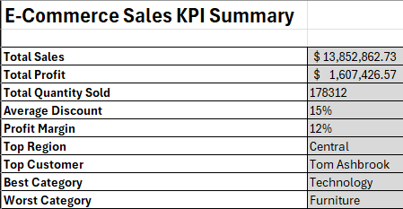
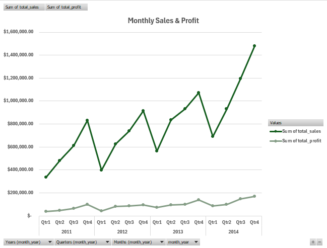
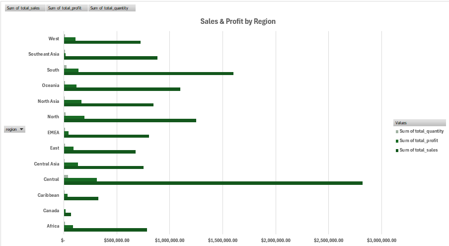
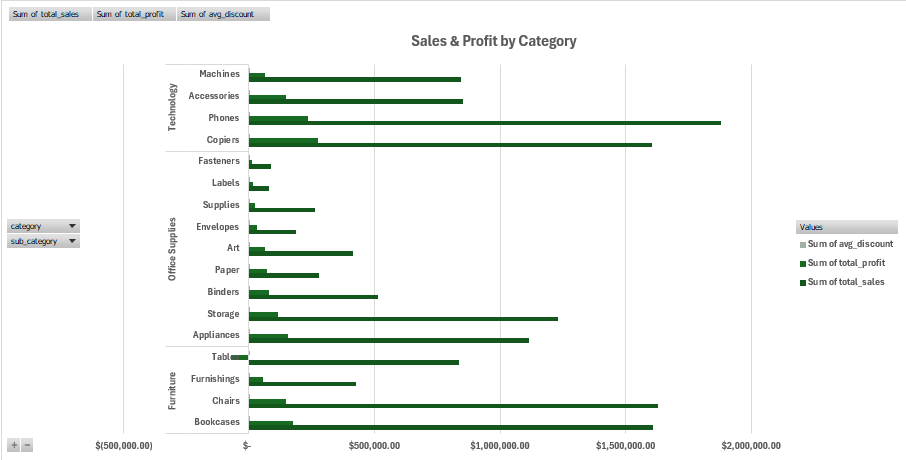
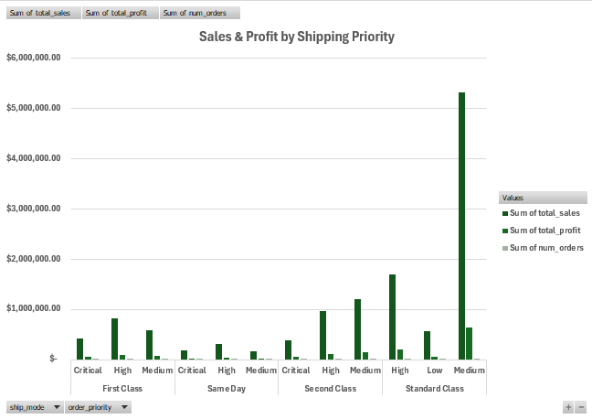

# E-Commerce Sales Analysis with MySQL & Excel

This project analyzes over **51,000 retail sales transactions** from a Global Superstore dataset to uncover sales trends, identify top-performing customers and regions, and evaluate product category performance. The project demonstrates an end-to-end analytics workflow beginning with raw data in MySQL and ending with an executive dashboard in Microsoft Excel.

The dataset was imported into **MySQL Workbench**, transformed into a **Star Schema**, analyzed using SQL views, and exported into **Excel** where KPI reporting, Pivot Tables, and executive dashboards were created.

> Dataset Source: Global Superstore Dataset
> https://www.kaggle.com/datasets/apoorvaappz/global-super-store-dataset/data

---

## Business Questions

- Which regions generate the highest sales and profit?
- Who are the company's top customers?
- How do sales and profits change over time?
- Which product categories are the most profitable?
- How does shipping method impact overall profitability?
- What KPIs best summarize overall business performance?

---

## SQL Workflow

The project follows a complete analytics pipeline:

1. Imported the Global Superstore dataset into MySQL.
2. Cleaned and validated the dataset.
3. Designed a Star Schema consisting of fact and dimension tables.
4. Created reusable SQL views for reporting.
5. Exported SQL results into CSV files.
6. Imported the data into Excel.
7. Built an executive dashboard using Pivot Tables, KPIs, and charts.

---

## Dashboard Visualizations

### Executive KPI Dashboard

Provides a high-level summary of overall business performance including Total Sales, Total Profit, Profit Margin, Total Quantity Sold, Top Region, and Top Customer.



---

### Monthly Sales & Profit Trend

Line chart illustrating monthly sales and profit performance over time, helping identify seasonality and long-term trends.



---

### Sales & Profit by Region

Compares regional sales and profitability to identify the strongest and weakest performing markets.



---

### Sales & Profit by Category

Highlights which product categories contribute the most revenue and profit.



---

### Sales & Profit by Shipping Method

Compares shipping methods to evaluate their impact on sales volume and profitability.



---

## Key Insights

- Regional performance varies significantly, highlighting opportunities for targeted sales strategies.
- A relatively small number of customers contribute a large share of total revenue.
- Product profitability differs across categories, helping identify high-value product lines.
- Monthly trends reveal seasonal fluctuations that can improve inventory planning and forecasting.
- Shipping methods influence both operational efficiency and profitability.

---

## Skills Demonstrated

### SQL

- Data Cleaning
- Data Validation
- Star Schema Design
- SQL Views
- Aggregations
- Joins
- Business Reporting

### Microsoft Excel

- Power Query
- Pivot Tables
- KPI Development
- Dashboard Design
- Executive Reporting
- Data Visualization

---

## Tools Used

- MySQL Workbench
- Microsoft Excel
- Git & GitHub

---

## Repository Structure

```
e-commerce-sales-analysis/
│
├── data/
├── sql/
├── excel/
├── images/
├── docs/
└── README.md
```

---

## Future Improvements

- Develop a Power BI version of the dashboard.
- Automate the ETL process using Python.
- Perform exploratory data analysis (EDA).
- Build predictive sales forecasting models.
- Create an interactive Power BI dashboard with slicers and drill-through functionality.

---
